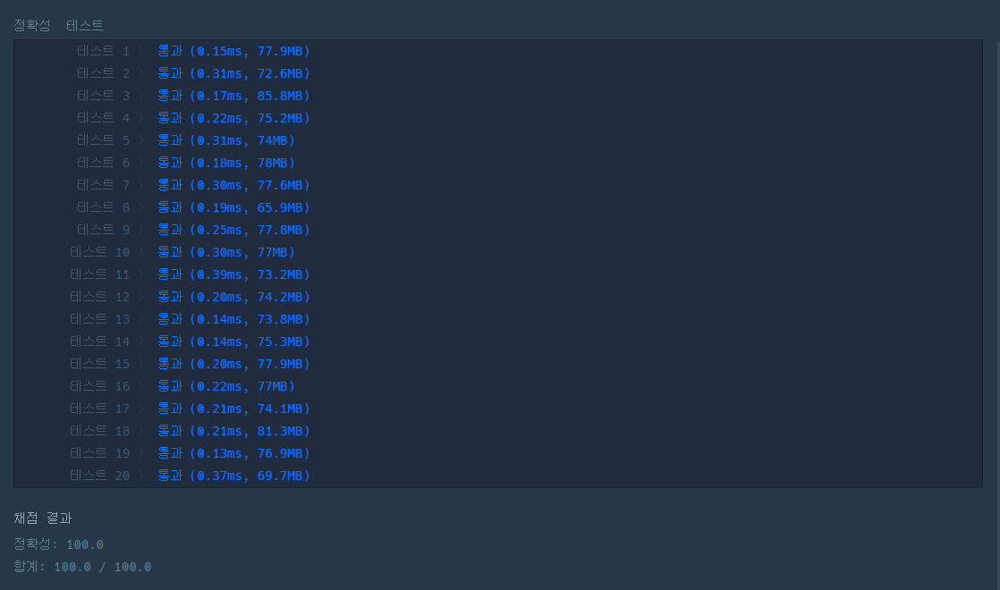

# [level 2] 영어 끝말잇기 - 12981 

[문제 링크](https://school.programmers.co.kr/learn/courses/30/lessons/12981) 

### 성능 요약

메모리: 69.7 MB, 시간: 0.37 ms

### 구분

코딩테스트 연습 > Summer／Winter Coding（～2018）

### 채점결과

정확성: 100.0<br/>합계: 100.0 / 100.0

### 제출 일자

2024년 07월 06일 23:49:45

### 문제 설명

<p>1부터 n까지 번호가 붙어있는 n명의 사람이 영어 끝말잇기를 하고 있습니다. 영어 끝말잇기는 다음과 같은 규칙으로 진행됩니다. </p>

<ol>
<li>1번부터 번호 순서대로 한 사람씩 차례대로 단어를 말합니다. </li>
<li>마지막 사람이 단어를 말한 다음에는 다시 1번부터 시작합니다. </li>
<li>앞사람이 말한 단어의 마지막 문자로 시작하는 단어를 말해야 합니다. </li>
<li>이전에 등장했던 단어는 사용할 수 없습니다. </li>
<li>한 글자인 단어는 인정되지 않습니다. </li>
</ol>

<p>다음은 3명이 끝말잇기를 하는 상황을 나타냅니다. </p>

<p>tank → kick → know → wheel → land → dream → mother → robot → tank</p>

<p>위 끝말잇기는 다음과 같이 진행됩니다.</p>

<ul>
<li>1번 사람이 자신의 첫 번째 차례에 tank를 말합니다.</li>
<li>2번 사람이 자신의 첫 번째 차례에 kick을 말합니다.</li>
<li>3번 사람이 자신의 첫 번째 차례에 know를 말합니다.</li>
<li>1번 사람이 자신의 두 번째 차례에 wheel을 말합니다.</li>
<li>(계속 진행)</li>
</ul>

<p>끝말잇기를 계속 진행해 나가다 보면, 3번 사람이 자신의 세 번째 차례에 말한 tank 라는 단어는 이전에 등장했던 단어이므로 탈락하게 됩니다. </p>

<p>사람의 수 n과 사람들이 순서대로 말한 단어 words 가 매개변수로 주어질 때, 가장 먼저 탈락하는 사람의 번호와 그 사람이 자신의 몇 번째 차례에 탈락하는지를 구해서 return 하도록 solution 함수를 완성해주세요.</p>

<h5>제한 사항</h5>

<ul>
<li>끝말잇기에 참여하는 사람의 수 n은 2 이상 10 이하의 자연수입니다.</li>
<li>words는 끝말잇기에 사용한 단어들이 순서대로 들어있는 배열이며, 길이는 n 이상 100 이하입니다.</li>
<li>단어의 길이는 2 이상 50 이하입니다.</li>
<li>모든 단어는 알파벳 소문자로만 이루어져 있습니다.</li>
<li>끝말잇기에 사용되는 단어의 뜻(의미)은 신경 쓰지 않으셔도 됩니다.</li>
<li>정답은 [ 번호, 차례 ] 형태로 return 해주세요.</li>
<li>만약 주어진 단어들로 탈락자가 생기지 않는다면, [0, 0]을 return 해주세요.</li>
</ul>

<hr>

<h5>입출력 예</h5>
<table class="table">
        <thead><tr>
<th>n</th>
<th>words</th>
<th>result</th>
</tr>
</thead>
        <tbody><tr>
<td>3</td>
<td>["tank", "kick", "know", "wheel", "land", "dream", "mother", "robot", "tank"]</td>
<td>[3,3]</td>
</tr>
<tr>
<td>5</td>
<td>["hello", "observe", "effect", "take", "either", "recognize", "encourage", "ensure", "establish", "hang", "gather", "refer", "reference", "estimate", "executive"]</td>
<td>[0,0]</td>
</tr>
<tr>
<td>2</td>
<td>["hello", "one", "even", "never", "now", "world", "draw"]</td>
<td>[1,3]</td>
</tr>
</tbody>
      </table>
<h5>입출력 예 설명</h5>

<p>입출력 예 #1<br>
3명의 사람이 끝말잇기에 참여하고 있습니다.</p>

<ul>
<li>1번 사람 : tank, wheel, mother</li>
<li>2번 사람 : kick, land, robot</li>
<li>3번 사람 : know, dream, <code>tank</code></li>
</ul>

<p>와 같은 순서로 말을 하게 되며, 3번 사람이 자신의 세 번째 차례에 말한 <code>tank</code>라는 단어가 1번 사람이 자신의 첫 번째 차례에 말한 <code>tank</code>와 같으므로 3번 사람이 자신의 세 번째 차례로 말을 할 때 처음 탈락자가 나오게 됩니다.</p>

<p>입출력 예 #2<br>
5명의 사람이 끝말잇기에 참여하고 있습니다.</p>

<ul>
<li>1번 사람 : hello, recognize, gather</li>
<li>2번 사람 : observe,  encourage, refer</li>
<li>3번 사람 : effect, ensure, reference</li>
<li>4번 사람 : take, establish, estimate</li>
<li>5번 사람 : either, hang, executive</li>
</ul>

<p>와 같은 순서로 말을 하게 되며, 이 경우는 주어진 단어로만으로는 탈락자가 발생하지 않습니다. 따라서 [0, 0]을 return하면 됩니다.</p>

<p>입출력 예 #3<br>
2명의 사람이 끝말잇기에 참여하고 있습니다.</p>

<ul>
<li>1번 사람 : hello, even, <code>now</code>, draw</li>
<li>2번 사람 : one, never, world</li>
</ul>

<p>와 같은 순서로 말을 하게 되며, 1번 사람이 자신의 세 번째 차례에 'r'로 시작하는 단어 대신, n으로 시작하는 <code>now</code>를 말했기 때문에 이때 처음 탈락자가 나오게 됩니다.</p>


> 출처: 프로그래머스 코딩 테스트 연습, https://school.programmers.co.kr/learn/challenges

# 풀이 전략
선입 선출이라 Que 를 쓰기로 했고 답안을 계속 기록하기위해 set 을 썼다.
그리고 무엇보다 외부에서 오는 값은 모두 검사되어야한다는 규칙을 지키기 위해 vali check 을 했다.

# 내 코드

```java
import java.util.*;
class Solution {
    public int[] solution(int n, String[] words) {
        int[] answer = {};
        Map<Integer, Integer>participantMap = new HashMap();
        Set<String>answerSet = new HashSet();
        Queue<Integer> que = new LinkedList();
        for(int i = 1; i <= n; i ++){
            participantMap.put(i,1);
            que.add(i);
        }
        if(words[0].length() < 2 && words[0].length() > 50) return new int[]{1,1};
        participantMap.put(1,2);
        int person = que.poll();
        que.add(person);
        answerSet.add(words[0]);
        for(int i = 1; i < words.length; i++){
            person = que.poll();
            if(words[i].length() < 2 && words[i].length() > 50) return new int[]{person, participantMap.get(person)};
            if(answerSet.contains(words[i]) || words[i-1].charAt(words[i-1].length()-1) != words[i].charAt(0)){
                return new int[]{person, participantMap.get(person)};
            }
            participantMap.put(person, participantMap.get(person) + 1);
            que.add(person);
            answerSet.add(words[i]);
        }

        return  new int[]{0,0};
    }
    
}
```

