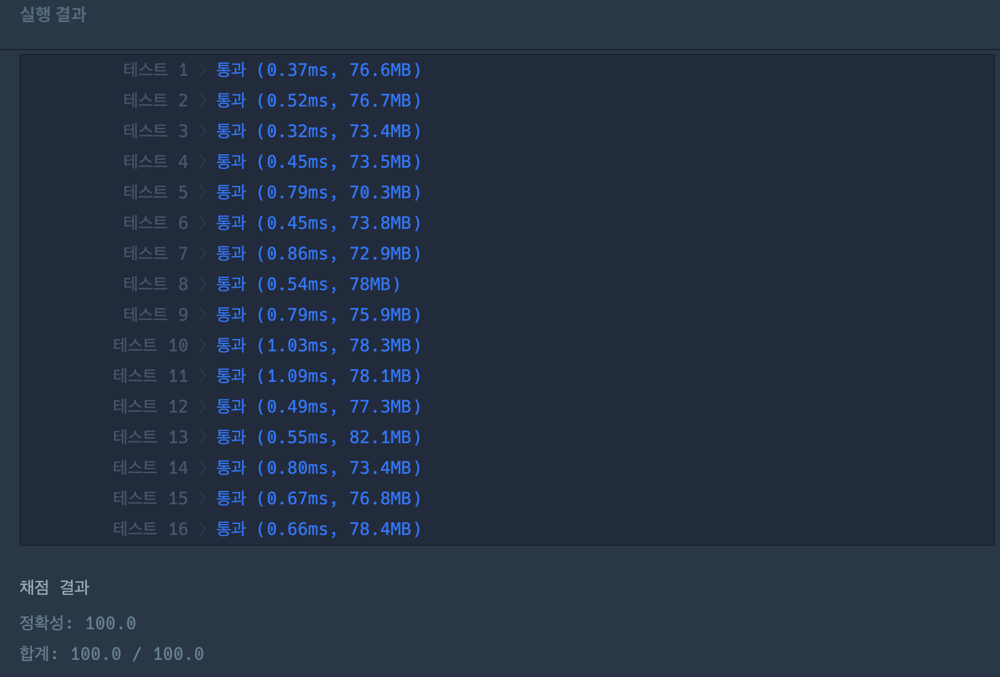

# [level 2] 숫자 변환하기 - 154538 

[문제 링크](https://school.programmers.co.kr/learn/courses/30/lessons/154538#) 

### 성능 요약

메모리: 78.1 MB, 시간: 1.09 ms

### 구분

코딩테스트 연습 > 연습문제

### 채점결과

정확성: 100.0<br/>합계: 100.0 / 100.0

### 제출 일자

2024년 07월 31일 21:31:15

### 문제 설명

<p>자연수 <code>x</code>를 <code>y</code>로 변환하려고 합니다. 사용할 수 있는 연산은 다음과 같습니다.</p>

<ul>
<li><code>x</code>에 <code>n</code>을 더합니다</li>
<li><code>x</code>에 2를 곱합니다.</li>
<li><code>x</code>에 3을 곱합니다.</li>
</ul>

<p>자연수 <code>x</code>, <code>y</code>, <code>n</code>이 매개변수로 주어질 때, <code>x</code>를 <code>y</code>로 변환하기 위해 필요한 최소 연산 횟수를 return하도록 solution 함수를 완성해주세요. 이때 <code>x</code>를 <code>y</code>로 만들 수 없다면 -1을 return 해주세요.</p>

<hr>

<h5>제한사항</h5>

<ul>
<li>1&nbsp;≤&nbsp;<code>x</code> ≤ <code>y</code>&nbsp;≤ 1,000,000</li>
<li>1 ≤ <code>n</code> &lt; <code>y</code></li>
</ul>

<hr>

<h5>입출력 예</h5>
<table class="table">
        <thead><tr>
<th>x</th>
<th>y</th>
<th>n</th>
<th>result</th>
</tr>
</thead>
        <tbody><tr>
<td>10</td>
<td>40</td>
<td>5</td>
<td>2</td>
</tr>
<tr>
<td>10</td>
<td>40</td>
<td>30</td>
<td>1</td>
</tr>
<tr>
<td>2</td>
<td>5</td>
<td>4</td>
<td>-1</td>
</tr>
</tbody>
      </table>
<hr>

<h5>입출력 예 설명</h5>

<p>입출력 예 #1<br>
<code>x</code>에 2를 2번 곱하면 40이 되고 이때가 최소 횟수입니다.</p>

<p>입출력 예 #2<br>
<code>x</code>에 <code>n</code>인 30을 1번 더하면 40이 되고 이때가 최소 횟수입니다.</p>

<p>입출력 예 #3<br>
<code>x</code>를 <code>y</code>로 변환할 수 없기 때문에 -1을 return합니다.</p>


> 출처: 프로그래머스 코딩 테스트 연습, https://school.programmers.co.kr/learn/challenges


# 풀이 전략
bfs 로 풀면서 같은 depth까지 연산을 해봤을 때 정답에 도달하면 그 다음 depth 는 볼 필요가 없다. 그리고 거꾸로 가는게 더 빠를 것같다.

여기까지가 내 전략이었는데 결국 시초가 떴다. 다른 방법이 생각이 안나서 질문게시판 갔다가 보니까 set으로 이미 도달한 값은 볼 필요 없으니 거르면서 하라는걸 보고 내 코드에 적용해봤더니 풀렸다.

# 코드
```java
import java.util.*;
class Solution {
    public int solution(int x, int y, int n) {
        class Pos{
            int y;
            int cnt;
            boolean depth;
            public Pos(int y, int cnt, boolean depth){
                this.y = y;
                this.cnt = cnt;
                this.depth = depth;
            }
        }
        int answer = Integer.MAX_VALUE;
        Queue<Pos> que = new LinkedList();
        Set<Integer> set = new HashSet();
        que.add(new Pos(y,0,true));
        set.add(y);
        Pos temp;
        int count = 0;
        boolean check = false;
        while(!que.isEmpty()){
            temp = que.poll();
            if(temp.y <= 0){
                if(temp.depth){
                    break;
                }
                continue;
            }
            if(temp.y == x){  // 이거 그 루트까지만 보고 말아야함
                answer = Integer.min(answer, temp.cnt);
                check = true;
                if(temp.depth){
                    break;
                }
            }
            
            if(temp.y % 3 == 0 && !set.contains(temp.y / 3)){
                que.add(new Pos((temp.y / 3),temp.cnt + 1,false));
                set.add(temp.y / 3);
            }
            if(temp.y % 2 == 0 && !set.contains(temp.y / 2)){
                que.add(new Pos((temp.y / 2),temp.cnt + 1,false));
                set.add(temp.y / 2);
            }
            if(temp.y > n && !set.contains(temp.y + n)){
                que.add(new Pos((temp.y - n),temp.cnt + 1,true));
                set.add(temp.y + n);
            }
            
        }
        if(!check) return -1;
        return answer;
    }
}
```

# 결과
